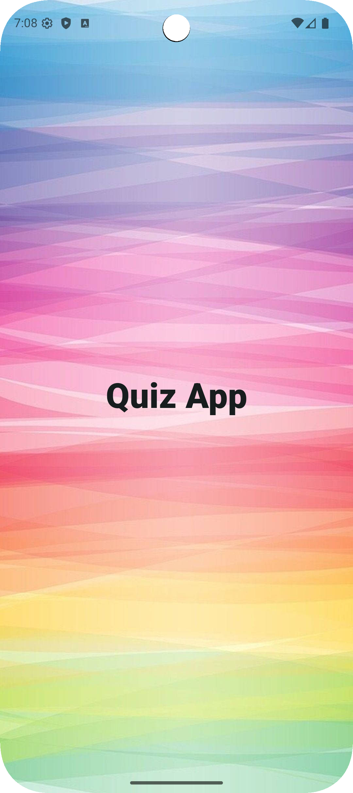
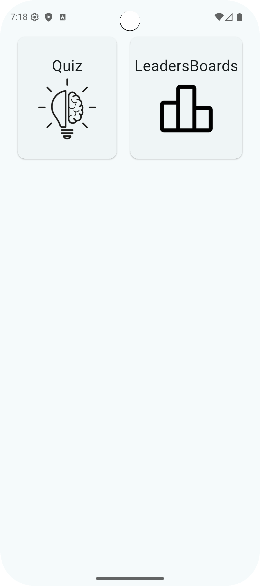
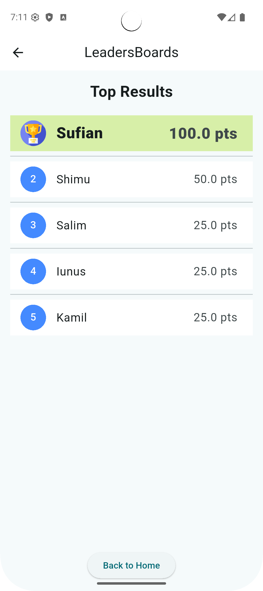
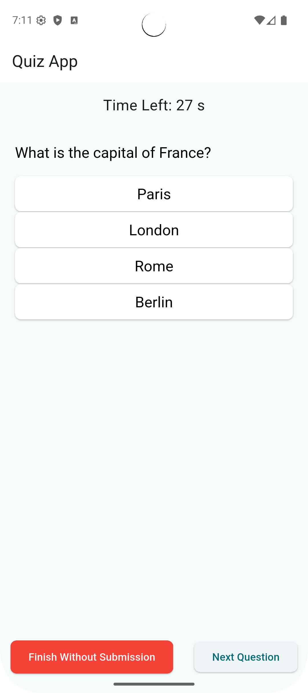
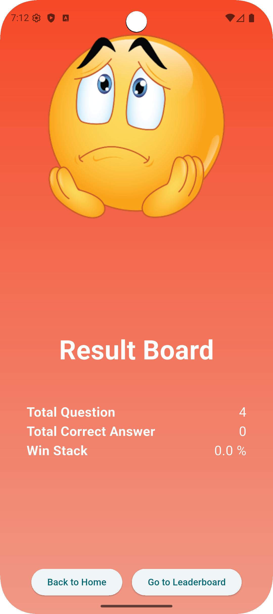
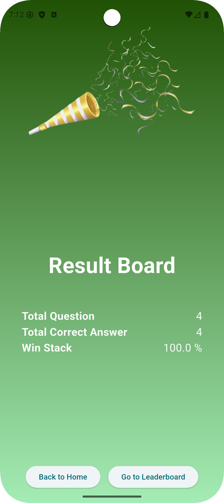

# quiz_app

**environment sdk version**: 3.8.0\
**for latex used**: flutter_math_fork\
**per question get**: 30 seconds

**build runner need to run**:\
```dart run build_runner watch -d```\
for generating

**architecture**: bloc\
**injectable**: injectable used with get_it
\
\
\







